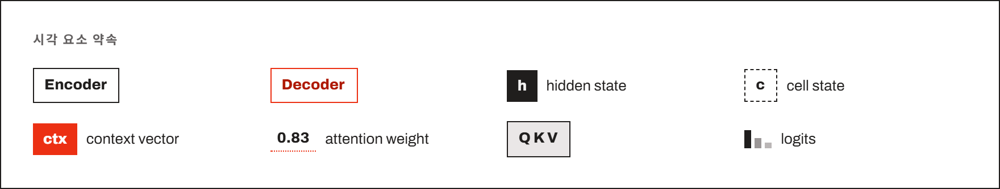
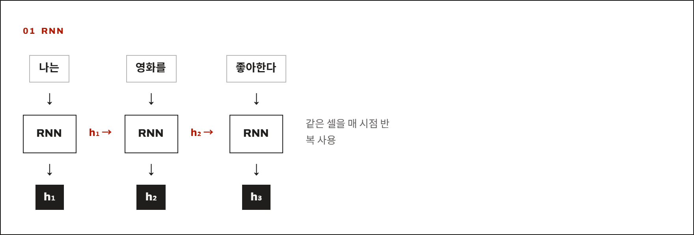
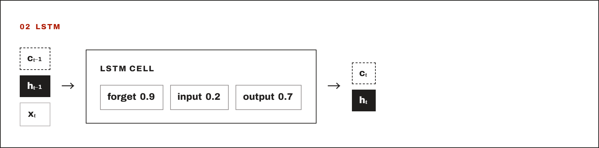
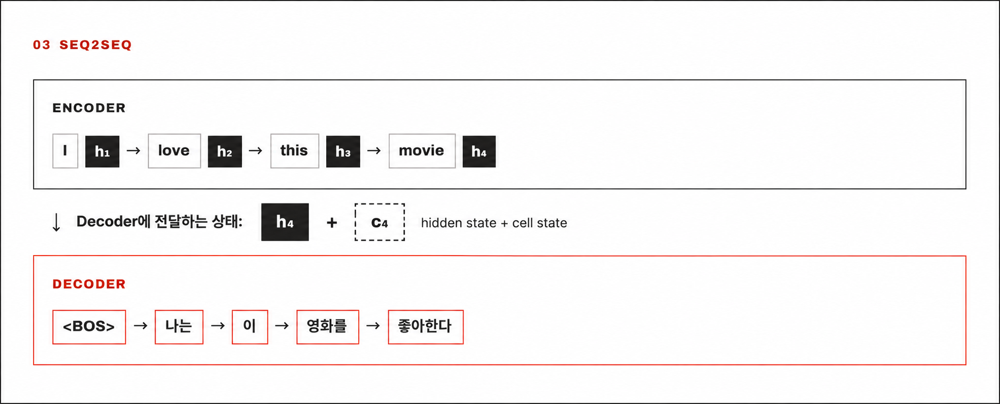
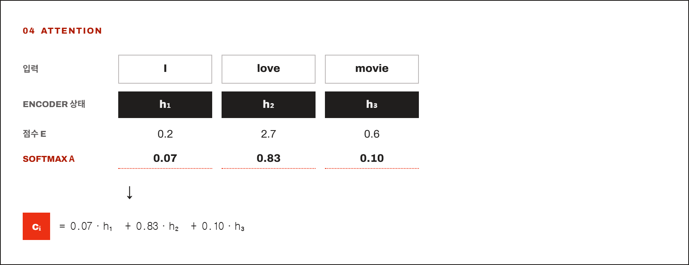
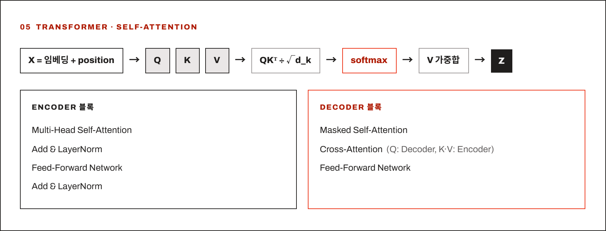
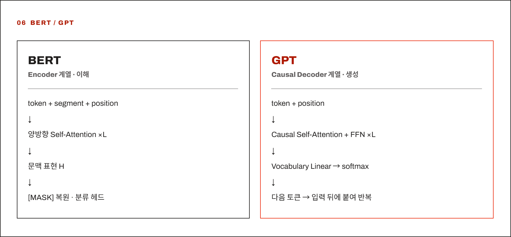

# RNN에서 GPT까지 — 발전 과정과 계산 원리

문장을 읽고 다른 문장을 만드는 모델에는 세 가지 질문이 생깁니다. **앞에서 읽은 내용을 어떻게 기억할까? 입력을 출력에 어떻게 전달할까? 필요한 정보를 어떻게 찾아 쓸까?** 이 노트는 RNN → LSTM → Seq2Seq → Attention → Transformer → BERT / GPT를 따라 이 질문에 대한 해법을 연결합니다. 개념을 이해하기 위한 순서이며, 뒤의 모델이 앞의 모델을 모두 대체했다는 뜻은 아닙니다.

RNN과 LSTM에서는 문장을 읽으며 상태를 갱신하고 다음 토큰을 예측하는 과정을 설명합니다. Seq2Seq부터 Transformer까지는 다음 번역 예시로 입력 문장과 출력 문장의 연결을 설명합니다. 마지막으로 BERT의 토큰 복원과 GPT의 다음 토큰 예측을 비교합니다.

```text
입력: I love this movie
출력: 나는 이 영화를 좋아한다
```

## 용어 구분

모델 이름처럼 나열되어 있지만, 셀·구성 방식·계산 방법이 섞여 있습니다. 아래는 앞으로 읽을 내용의 지도이며, 각 부품의 계산은 해당 절에서 설명합니다.

| 용어 | 무엇인가 |
| --- | --- |
| RNN | 이전 상태를 다음 계산에 넘기는 **순환 신경망 계열** |
| LSTM | RNN에서 기억을 갱신하는 방식을 개선한 **셀** |
| Seq2Seq | 입력 시퀀스를 출력 시퀀스로 바꾸는 **구성 방식**. 여기서는 Encoder–Decoder로 설명 |
| Attention | 관련도에 따라 여러 위치의 표현을 가중합하는 **계산 장치** |
| Transformer | Attention과 위치별 신경망을 결합한, 순환 연결 없는 **모델 구조** |
| BERT | Transformer Encoder 계열 |
| GPT | 이전 토큰만 보고 다음 토큰을 예측하는 Transformer Decoder 계열 |

**셀(cell)** 은 한 시점의 입력과 이전 상태로 새 상태를 만드는 계산 단위입니다. 이 노트의 번역 구성에서 **Encoder**는 입력 문장을 벡터로 표현하고, **Decoder**는 Encoder의 표현과 이전 출력 토큰을 이용해 다음 출력 토큰을 예측합니다. GPT의 Decoder는 별도 Encoder의 출력 없이, 입력된 토큰 이력으로 다음 토큰을 예측합니다.

## 공통 전제 — 토큰과 임베딩

모델은 글자 자체를 계산할 수 없으므로 먼저 숫자로 바꿉니다. **토큰(token)** 은 텍스트를 처리하는 단위이고, **토크나이저(tokenizer)** 는 텍스트를 토큰으로 나눠 ID를 부여합니다. **임베딩(embedding)** 은 각 ID에 대응하는 숫자 벡터입니다.

```text
토큰 "영화를" → 토큰 ID 4217 → embedding matrix 조회 → E(영화를) ∈ ℝ⁵¹²
```

임베딩 행렬(embedding matrix)은 토큰 ID별 벡터를 모은 표입니다. 위의 E는 이 표에서 벡터를 꺼내는 연산이고, ℝ⁵¹²는 실수 512개로 이루어진 벡터라는 뜻입니다. 임베딩 행렬도 보통 모델과 함께 학습합니다.

여기서는 설명을 위해 단어를 토큰처럼 씁니다. 실제로는 단어보다 작은 조각(subword)으로 나눌 수 있으며, 토큰 ID와 벡터 차원은 모델마다 다릅니다. 이후 계산 예시의 숫자도 실제 학습 결과가 아닌 설명용 값입니다.

## 공통 전제 — 무엇이 학습되는가

**이 노트의 모델은 정답 토큰에 부여하는 확률을 높이도록 파라미터를 학습합니다.** 파라미터는 모델이 저장하는 가중치 W와 편향 b 등입니다. 가중치는 입력 벡터의 각 성분을 얼마나 반영할지 정하고, 편향은 가중합에 더하는 학습 가능한 값입니다.

학습은 예측의 오차를 나타내는 **손실(loss)** 을 계산하는 데서 시작합니다. **역전파(backpropagation)** 는 각 파라미터를 바꾸면 손실이 얼마나 달라지는지 나타내는 기울기를 계산하고, **옵티마이저(optimizer)** 는 이 기울기를 이용해 파라미터를 갱신합니다. 번역에서는 정답 토큰에 더 높은 확률을 주도록 임베딩부터 출력층까지 함께 학습합니다.

여기서 **학습으로 저장하는 파라미터**와 **그 파라미터에 현재 입력을 넣어 계산한 값**은 다릅니다. 같은 가중치를 써도 입력 문장이 달라지면 내부 표현과 예측이 달라집니다. 이 구분은 뒤의 LSTM 게이트와 Attention을 이해할 때도 중요합니다.

**추론(inference)** 은 학습한 모델로 새 입력의 답을 계산하는 과정입니다. 일반적인 추론에서는 파라미터를 고정합니다.

## 그림과 수식 읽는 법



그림에서는 검은 테두리와 빨간 테두리로 Encoder와 Decoder를 구분합니다. 검은 칩은 내부 상태인 **hidden state(은닉 상태)**, 점선 칩은 LSTM의 기억 통로인 **cell state(셀 상태)**, 빨간 칩은 입력에서 모은 정보인 **context vector(문맥 벡터)** 입니다. 각 상태의 역할은 해당 절에서 설명합니다.

수식의 아래 첨자 t와 i는 처리 시점을 뜻합니다. $x_t$는 현재 토큰의 임베딩, $h_t$는 hidden state입니다. 같은 기호라도 서로 다른 모델·층에서 쓰는 가중치는 별개입니다. 나머지 기호는 처음 쓰는 곳에서 정의합니다.

---

## 01 · RNN

Elman, *Finding Structure in Time* (1990)



토큰을 순서대로 하나씩 받아, 현재 입력과 이전 hidden state로 새 hidden state를 계산합니다. 이 벡터가 다음 시점에 전달되는 입력 이력의 요약입니다. 한 층에서는 모든 시점에 같은 셀 계산과 파라미터를 반복 사용합니다.

여기서는 가장 기본적인 RNN 셀을 다룹니다. 아래 계산은 **현재 입력을 변환한 값 + 이전 상태를 변환한 값 + 편향**을 더하고, tanh를 적용해 각 원소를 −1과 1 사이로 바꿉니다. tanh는 단순한 선형 변환만으로 표현하기 어려운 관계를 학습하게 하는 비선형 함수입니다. 첫 상태 $h_0$는 보통 0으로 시작합니다.

```math
h_t = \tanh(W_x x_t + W_h h_{t-1} + b)
```

작은 예시 — 그림의 짧은 문장 `나는 영화를 좋아한다`를 읽는다고 하겠습니다. "나는"을 읽은 상태가 $h_1 = [0.4, -0.2]$이고, 다음 입력 "영화를"과 이전 상태의 가중합이 $W_x x_2 + W_h h_1 + b = [0.8673, 0.1003]$이라고 가정하면, tanh를 적용한 새 상태는 $h_2 \approx [0.7, 0.1]$입니다.

이제 이 상태로 **다음 토큰을 예측하는 출력층**을 붙입니다. 아래 식은 $h_t$를 후보 토큰별 점수로 바꾼 뒤, softmax로 합이 1인 확률분포 $p_t$를 만듭니다.

```math
p_t = \mathrm{softmax}(W_{\mathrm{out}} h_t + b_{\mathrm{out}})
```

예시의 $h_2$는 `나는 영화를`까지 읽은 상태이므로, $p_2$는 그다음 토큰의 확률분포입니다. 학습에서는 정답인 `좋아한다`의 확률이 높아지도록 RNN과 출력층의 파라미터를 함께 갱신합니다. **RNN 셀은 상태를 갱신하고, 출력층은 그 상태로 토큰 확률을 계산합니다.**

| 유지 | 추가 | 제거 |
| --- | --- | --- |
| 토큰 임베딩 입력 | 순환 연결 $h_{t-1} \to h_t$ | 없음 (출발점) |

**남은 문제** — 입력과 이전 상태를 반복해서 변환하므로 오래된 정보가 이후 상태에서 약해질 수 있습니다. 학습 중 여러 시점을 거슬러 역전파할 때 기울기가 지나치게 작아지거나 커지는 **기울기 소실·폭주**도 발생할 수 있습니다. 다음의 LSTM은 별도 기억 통로와 게이트를 두어 특히 기울기 소실을 완화하고, 필요한 정보를 오래 유지하도록 돕습니다.

## 02 · LSTM

Hochreiter & Schmidhuber, *Long Short-Term Memory* (1997)



LSTM은 hidden state 외에 **cell state $c_t$라는 기억 통로**를 둡니다. 세 개의 **게이트(gate)** 가 이전 cell state의 유지 비율, 새 후보 기억의 반영 비율, cell state로부터 hidden state를 만드는 비율을 조절합니다. 각 게이트는 벡터의 성분마다 0과 1 사이의 계수를 계산합니다.

아래는 forget gate를 포함한 현대적인 표준 LSTM입니다. 각 게이트에는 **서로 다른 학습 가능한 가중치와 편향**이 있으며, 같은 층의 모든 시점에서 공유합니다. 먼저 세 게이트와 후보 기억을 계산하고, 이를 이용해 cell state와 hidden state를 갱신합니다.

```math
f_t = \sigma(W_f [h_{t-1}, x_t] + b_f)
```

```math
i_t = \sigma(W_i [h_{t-1}, x_t] + b_i)
```

```math
o_t = \sigma(W_o [h_{t-1}, x_t] + b_o)
```

```math
g_t = \tanh(W_g [h_{t-1}, x_t] + b_g)
```

```math
c_t = f_t \odot c_{t-1} + i_t \odot g_t
```

```math
h_t = o_t \odot \tanh(c_t)
```

대괄호는 이전 hidden state와 현재 입력의 이어 붙이기(concatenation), σ는 각 원소를 0과 1 사이로 바꾸는 sigmoid 함수, ⊙는 같은 위치의 원소끼리 곱하는 연산입니다. 각 게이트에 sigmoid를 따로 적용하므로 세 게이트의 합이 1일 필요는 없습니다. 후보 기억 $g_t$는 cell state에 추가할 값이며, input gate가 그 반영 비율을 정합니다.

| Gate | 역할 | 값이 1에 가까울 때 |
| --- | --- | --- |
| Forget gate (f) | 이전 cell state를 얼마나 유지할지 조절 | 이전 기억을 많이 유지 |
| Input gate (i) | 후보 기억을 얼마나 기록할지 조절 | 새 내용을 많이 기록 |
| Output gate (o) | tanh를 적용한 cell state를 hidden state에 얼마나 반영할지 조절 | tanh로 변환한 값을 덜 줄여서 전달 |

### 게이트는 어떻게 학습될까?

**학습되는 것은 게이트 값을 만드는 가중치 W와 편향 b입니다.** 예를 들어 forget gate의 값 0.9를 모든 문장에 고정해서 쓰는 것이 아닙니다. 현재 토큰과 이전 hidden state를 학습된 계산식에 넣어, 매 시점 게이트 값을 구합니다. 후보 기억을 만드는 가중치와 편향도 함께 학습합니다.

앞의 예시처럼 `나는 영화를`까지 읽고 다음 토큰 `좋아한다`를 예측한다고 하겠습니다. 모델이 정답에 낮은 확률을 줬다면 손실이 커집니다. 학습에서는 이 손실에서 출발해 출력층, 현재 LSTM 상태, 그 상태를 만드는 데 사용한 이전 시점의 계산으로 거슬러 올라가며 기울기를 구합니다. 이 과정을 **BPTT(Backpropagation Through Time, 시간축 역전파)** 라고 합니다.

각 시점에서 같은 가중치를 사용했으므로, 여러 시점에서 구한 기울기의 기여를 합쳐 공유 가중치를 갱신합니다. 이 학습을 반복하면서 정답 예측에 도움이 되는 정보를 유지하거나 기록하도록 게이트의 계산식이 조정됩니다. 기본 RNN도 같은 방식으로 학습하며, LSTM에서는 게이트와 cell state 계산까지 역전파 경로에 포함됩니다.

### Output gate와 어휘 출력층은 어떻게 다를까?

**Output gate는 hidden state를 만드는 LSTM 내부 부품**입니다. Cell state에 tanh를 적용한 뒤 output gate 값을 원소별로 곱해 hidden state를 만듭니다. 이 단계에서는 아직 토큰별 확률을 계산하지 않습니다.

**어휘 출력층은 hidden state로 다음 토큰의 확률을 구하는 부품**입니다. Hidden state를 후보 토큰별 점수로 변환하고, softmax를 적용해 확률분포를 만듭니다.

```text
cell state
    ↓ tanh 적용 후 output gate 값을 원소별로 곱함
hidden state
    ↓ 어휘 출력층으로 후보 토큰별 점수 계산
    ↓ softmax 적용
다음 토큰의 확률분포
```

따라서 output gate의 가중치는 **hidden state에 반영할 비율**을 계산하고, 어휘 출력층의 가중치는 **후보 토큰별 점수**를 계산합니다. 서로 다른 파라미터지만, 같은 다음 토큰 예측 손실로 함께 학습합니다.

작은 예시 — 기억 벡터의 한 성분에서 $c_{t-1} = 1.0$, $f_t = 0.9$, $i_t = 0.2$, $g_t = 0.5$이면 $c_t = 0.95$입니다. 그림처럼 $o_t = 0.7$이라면 $h_t = 0.7 \times \tanh(0.95) \approx 0.518$입니다. **cell state의 값이 출력층에 그대로 전달되는 것이 아니라, tanh와 output gate를 거친 hidden state가 전달됩니다.**

cell state의 덧셈 갱신과, forget gate가 1에 가까울 때 기억을 보존하는 직접 경로가 기울기 소실을 완화합니다. 다만 장기 기억을 무한히 보장하거나 기울기 문제를 완전히 없애지는 않습니다. [표준 LSTM 수식과 학습 파라미터](https://docs.pytorch.org/docs/stable/generated/torch.nn.modules.rnn.LSTM.html)

| 유지 | 추가 | 제거 |
| --- | --- | --- |
| 순차 처리, hidden state 전달, 다음 토큰 출력층 | cell state, forget·input·output gate | 하나의 tanh 식만으로 상태를 갱신하는 방식 |

**다음 과제** — 지금까지는 토큰을 읽으며 상태를 갱신하는 방법을 살펴봤습니다. 번역을 하려면 여기에 **입력 문장을 읽는 과정과 번역문을 생성하는 과정을 연결하는 구성**이 필요합니다. 이 두 역할을 나누는 것이 다음의 Seq2Seq입니다.

## 03 · Seq2Seq

Sutskever, Vinyals, Le, *Sequence to Sequence Learning with Neural Networks* (2014)



앞의 LSTM을 두 역할에 사용합니다. **Encoder**는 입력 문장을 끝까지 읽어 상태에 요약하고, **Decoder**는 그 요약에서 출발해 번역문을 한 토큰씩 만듭니다. 여기서는 두 모듈이 같은 종류의 셀을 사용하되 파라미터는 따로 학습합니다.

입력 길이를 T, 출력 시점을 i라고 하겠습니다. `enc`와 `dec`는 Encoder와 Decoder를 구분하는 표시입니다. Decoder 상태 $s_i$는 hidden state와 cell state의 쌍이며, 아래 식은 Encoder의 마지막 상태를 Decoder의 초기 상태로 넘기는 예시입니다.

```math
s_0 = (h_T^{enc}, c_T^{enc})
```

```math
s_i = \mathrm{LSTM}_{dec}(E(y_{i-1}),\, s_{i-1})
```

현재 출력 토큰을 $y_i$라고 할 때, Decoder는 이전 토큰의 임베딩 $E(y_{i-1})$과 이전 상태 $s_{i-1}$로 새 상태를 계산합니다. 여기서는 Encoder와 Decoder의 상태 크기가 같다고 가정하며, 크기나 층 구성이 다르면 변환을 둘 수 있습니다.

그림에서는 입력 4토큰을 읽은 뒤의 hidden state $h_4$와 cell state $c_4$를 Decoder의 초기 hidden state와 cell state로 각각 넘깁니다. 그림의 `+`는 두 상태를 모두 전달한다는 뜻이며, 두 벡터를 더하는 연산이 아닙니다. 전달하는 상태 쌍은 $(h_4, c_4)$입니다.

`<BOS>`는 생성 시작, `<EOS>`는 생성 종료를 나타내는 특수 토큰이며, Decoder의 첫 입력 $y_0$는 `<BOS>`입니다.

Decoder는 같은 LSTM을 반복 사용합니다. 아래 표에서는 각 행의 입력으로 새 상태를 계산한 뒤 토큰 하나를 고르고, 그 토큰과 새 상태를 다음 행의 입력으로 넘깁니다.

| 생성 시점 | 입력 | 예측 토큰 |
| --- | --- | --- |
| 1 | `<BOS>`, Encoder의 마지막 상태 | 나는 |
| 2 | 나는, $s_1$ | 이 |
| 3 | 이, $s_2$ | 영화를 |
| 4 | 영화를, $s_3$ | 좋아한다 |
| 5 | 좋아한다, $s_4$ | `<EOS>` |

이제 상태에서 실제 토큰을 고르는 과정을 보겠습니다. 후보는 토크나이저가 정한 **어휘 집합(vocabulary)** 입니다. Decoder 상태 안의 hidden state $h_i^{dec}$를 **선형층(Linear layer)** 에 넣어 후보별 점수인 **로짓(logits)** 을 만들고, softmax로 확률분포를 얻습니다. 여기서 선형층은 가중치 행렬을 곱하고 편향을 더하는 연산입니다.

```math
z_i = W_{\mathrm{out}} h_i^{dec} + b_{\mathrm{out}} \in \mathbb{R}^{N_{\mathrm{vocab}}}
```

```math
p_i = \mathrm{softmax}(z_i)
```

```math
P(y_i = v \mid y_1, \ldots, y_{i-1}, x) = p_i[v]
```

여기서 $N_{\mathrm{vocab}}$은 어휘 집합의 크기, v는 후보 토큰의 ID, $y_1, \ldots, y_{i-1}$은 이전 출력 토큰들, x는 전체 입력 문장입니다. $p_i[v]$는 확률분포에서 후보 v에 해당하는 값입니다. 가장 확률이 높은 토큰을 고르는 **greedy**나 확률에 따라 뽑는 **sampling**으로 다음 토큰을 정할 수 있습니다.

학습에서는 보통 모델이 직전에 고른 토큰 대신 이전 **정답 토큰**을 입력하는 **teacher forcing**을 사용합니다. 출력 시점 i에서는 이전 정답 토큰을 입력하고, 현재 예측 분포가 i번째 정답 토큰에 부여한 확률로 손실을 계산합니다. 이 손실로 Encoder와 Decoder의 LSTM 게이트까지 함께 학습합니다. 정답 토큰들을 미리 알아도 각 LSTM 상태는 이전 상태를 기다려야 하므로 시점 순서대로 계산합니다.

| 유지 | 추가 | 제거 |
| --- | --- | --- |
| LSTM 셀, 어휘 출력층 | Encoder·Decoder 연결, 시작·종료 토큰 | 입력을 읽는 시점과 출력을 생성하는 시점의 일대일 대응 |

**남은 문제** — 이 구성에서는 Decoder에 전달할 입력 정보를 Encoder의 마지막 상태에 모두 담아야 합니다. 입력 문장이 길어져도 전달 상태의 크기는 같아서 필요한 세부 정보를 충분히 담기 어려울 수 있습니다. 이를 **고정 벡터 병목**이라고 합니다.

## 04 · Attention (Bahdanau)

Bahdanau, Cho, Bengio, *Neural Machine Translation by Jointly Learning to Align and Translate* (2015)



고정 요약의 병목을 줄이기 위해 Encoder의 모든 위치별 hidden state를 보관합니다. **여기에 적용하는 Attention은 출력 시점마다 각 상태의 참고 비율을 계산하고, 그 비율로 상태들을 가중합합니다.** Decoder는 마지막 요약만 받던 구성에서, 매 시점 이 가중합 결과도 받는 구성으로 바뀝니다.

계산은 **관련도 점수 → 참고 비율 → context vector → Decoder 갱신** 순서입니다. 출력 시점 i에서 입력 위치 j를 얼마나 참고할지 점수 $e_{ij}$를 계산합니다. Bahdanau 방식은 Decoder와 Encoder 표현을 각각 변환해 더한 뒤 점수를 만들기 때문에 **additive attention**이라고 부릅니다. $v_a$도 학습하는 벡터이며, 위 첨자 ⊤는 전치를 뜻합니다.

```math
e_{ij} = v_a^{\top} \tanh\left(W_s h_{i-1}^{\mathrm{dec}} + W_h h_j^{\mathrm{enc}} + b_a\right)
```

```math
\alpha_{ij} = \frac{\exp(e_{ij})}{\sum_{k=1}^{T} \exp(e_{ik})}
```

```math
a_i = \sum_{j=1}^{T} \alpha_{ij} h_j^{\mathrm{enc}}
```

```math
s_i = \mathrm{LSTM}_{\mathrm{dec}}\left([E(y_{i-1}), a_i], s_{i-1}\right)
```

Softmax로 얻은 **attention weight $\alpha_{ij}$** 는 출력 시점 i에서 입력 위치 j를 참고하는 비율입니다. 분모는 모든 입력 위치의 점수에 exp를 적용해 더한 값이므로, 한 출력 시점에서 참고 비율의 합은 1입니다. 이 비율로 Encoder 상태들을 가중합한 **context vector $a_i$** 를 이전 토큰 임베딩과 이어 붙여 Decoder에 넣습니다. 그림은 같은 context를 c로 표시하지만, 본문에서는 LSTM의 cell state와 구분하려고 a를 사용합니다. Decoder가 갱신한 hidden state는 앞 절의 어휘 출력층으로 전달합니다.

여기서는 앞 절의 LSTM에 이 계산을 붙였습니다. 원 논문은 다른 종류의 순환 셀인 GRU를 사용했고, Encoder는 입력을 양쪽 방향으로 읽는 양방향 구조였습니다. Attention은 특정 순환 셀에만 묶인 계산이 아닙니다. [Bahdanau 원 논문](https://arxiv.org/html/1409.0473v7)

그림은 `I love movie`의 3토큰 예시입니다. 점수 `[0.2, 2.7, 0.6]`의 softmax는 약 `[0.068, 0.830, 0.102]`이고, 그림처럼 반올림하면 $a_i \approx 0.07 h_1^{enc} + 0.83 h_2^{enc} + 0.10 h_3^{enc}$입니다. 원래 4토큰 문장에서는 `this`까지 포함해 네 위치 모두에 대해 점수를 계산합니다. 시점마다 새로운 context가 만들어지며, Attention은 **입력의 어느 부분을 얼마나 참고할지** 정합니다.

**LSTM 게이트와 마찬가지로 Attention도 학습된 파라미터로 입력에 따른 값을 계산합니다.** 직접 학습하는 것은 점수 신경망의 파라미터이며, attention weight인 α는 매번 점수를 softmax에 넣어 얻는 계산 결과입니다. α 자체를 문장과 무관한 고정 파라미터로 저장하지 않습니다. 정답 토큰에 대한 손실은 점수 신경망뿐 아니라 Encoder·Decoder에도 역전파됩니다.

```math
L = -\sum_i \log P(y_i^{\ast} \mid y_1^{\ast}, \ldots, y_{i-1}^{\ast}, x)
```

별표(*)는 정답 토큰을 뜻합니다. 이 손실은 각 시점의 정답 토큰에 부여한 확률이 높을수록 작아집니다. Seq2Seq에서도 사용하는 다음 토큰 손실이며, Attention을 추가하면 점수 신경망에도 기울기가 전달됩니다. 따라서 어느 단어를 참고해야 하는지 별도로 지정하지 않고도 번역 정답으로 관련도 계산을 학습할 수 있습니다.

| 비교 | LSTM gate | Attention weight |
| --- | --- | --- |
| 조절 대상 | 기억 벡터의 각 차원 | 참고할 입력 토큰 위치 |
| 계산 | 학습된 선형 변환 + sigmoid | 학습된 관련도 점수 + softmax |
| 값의 관계 | 각 원소에 sigmoid 적용, 합 제약 없음 | 한 출력 시점에서 참고 위치에 대한 합이 1 |
| 목적 | 기억을 유지·기록·노출 | 여러 입력 상태에서 필요한 정보를 모으기 |

```text
손실 → 출력층 → Decoder → context vector → α → 점수 신경망 → Encoder
```

이는 역전파 경로 하나를 간단히 그린 것입니다. context의 가중합에서 Encoder 상태로 직접 이어지는 경로와, Decoder의 이전 상태·순환 연결로 이어지는 경로도 있습니다.

| 유지 | 추가 | 제거 |
| --- | --- | --- |
| Encoder LSTM, Decoder LSTM | 점수 신경망, α, 시점별 context | 마지막 고정 요약에만 의존하는 병목 |

**남은 문제** — 참고 범위는 넓어졌지만 Encoder·Decoder가 여전히 RNN이라 다음 순환 상태를 계산하려면 이전 상태를 기다려야 합니다. 배치나 Attention 점수 계산은 병렬화할 수 있어도, 시간축의 순환 의존성은 남습니다.

## 05 · Transformer

Vaswani et al., *Attention Is All You Need* (2017)



RNN 기반 Attention은 정보를 찾아볼 수 있어도 상태를 순서대로 계산해야 했습니다. Transformer는 **토큰 사이의 정보를 Attention으로 직접 주고받게 하고, 시간축 순환 연결을 없앱니다.** 2017년 원형 Transformer는 Encoder–Decoder 역할을 유지하면서 내부를 Attention과 위치별 신경망으로 구성한 블록으로 바꿨습니다.

### 위치 정보와 Q·K·V

순환 연결이 없어지면 처리 순서 자체로 토큰 위치를 전달할 수 없습니다. 그래서 첫 입력에는 토큰 임베딩과 **위치 인코딩(positional encoding)** 을 더합니다.

```math
X = \text{Token Embedding} + \text{Positional Encoding}
```

Attention을 계산할 때는 각 토큰 표현에서 세 벡터를 만듭니다. **Query(Q)** 는 해당 토큰이 무엇을 참고할지 점수를 매기는 표현, **Key(K)** 는 Query와 비교할 표현, **Value(V)** 는 실제로 모아 올 정보입니다. 입력에 가중치 행렬을 곱해 다른 표현으로 바꾸는 연산을 여기서는 **투영(projection)** 이라고 합니다.

```math
Q = XW^Q, \quad K = XW^K, \quad V = XW^V
```

이 절에서는 토큰 표현을 행으로 쌓은 행렬을 사용하므로 가중치를 오른쪽에 곱합니다. 앞의 RNN 수식은 토큰 벡터를 열로 두어 왼쪽에 곱했으며, 표기 방향만 다릅니다. **Q와 K의 전치 행렬을 곱해 관련도 점수 계산 → 크기 조정 → mask 적용 → softmax → V 가중합** 순서입니다. 관련도를 벡터 내적으로 구하고 크기를 조정하므로 **scaled dot-product attention**이라고 부릅니다.

```math
\mathrm{Attention}(Q, K, V) = \mathrm{softmax}\!\left(\frac{QK^\top}{\sqrt{d_k}} + M\right)V
```

$d_k$는 Key 벡터의 차원입니다. 그 제곱근으로 나누는 것은 큰 내적 때문에 softmax가 일부 위치에 지나치게 집중하는 것을 완화합니다. M은 **mask**, 즉 참고를 허용할 위치에 0, 가릴 위치에 음의 무한대를 더하는 행렬입니다. Softmax는 각 Query의 행에서 Key 위치들에 대해 적용하므로 가려진 위치의 확률은 0이 됩니다. 문장 길이를 맞추기 위해 넣는 채움 토큰인 **padding**도 가릴 수 있습니다.

### Self-Attention과 Cross-Attention

Q·K·V를 어느 시퀀스에서 가져오는지에 따라 역할이 달라집니다.

| 계산 | Q의 출처 | K·V의 출처 | 참고 범위 |
| --- | --- | --- | --- |
| Encoder Self-Attention | Encoder의 현재 입력 표현 | 같은 표현 | 입력 문장 전체 |
| Decoder Causal Self-Attention | Decoder의 현재 입력 표현 | 같은 표현 | 현재 위치와 이전 위치 |
| Decoder Cross-Attention | Decoder의 현재 표현 | Encoder 최종 출력 | 입력 문장 전체 |

**Self-Attention**은 Q와 K·V를 같은 시퀀스에서 만들고, **Cross-Attention**은 서로 다른 시퀀스에서 만듭니다. 이 번역 모델의 Cross-Attention은 Decoder가 Encoder 출력을 참고하는 데 쓰입니다. **Causal mask(인과 마스크)** 는 Decoder의 각 위치에서 뒤쪽 위치를 참고하지 못하게 합니다. 학습 때 전체 정답 시퀀스를 입력해도 미래 정답이 새어 들어오지 않게 하는 장치입니다.

```text
1번째 위치 · 1번 토큰만 참고
2번째 위치 · 1–2번 토큰 참고
3번째 위치 · 1–3번 토큰 참고
```

Cross-Attention은 앞 절의 Bahdanau Attention처럼 번역에 필요한 입력 정보를 모읍니다. 참고할 정보를 찾는 역할은 이어지지만 관련도 점수를 계산하는 방식은 달라졌습니다.

### 하나의 블록을 구성하는 나머지 부품

자체 Q·K·V 투영으로 Attention 결과를 계산하는 한 단위를 **Attention head**라고 합니다. **Multi-Head Attention**은 head마다 서로 다른 투영을 사용해 여러 결과를 만들고, 이어 붙인 뒤 출력 투영으로 합칩니다. 이렇게 여러 종류의 관계를 표현할 수 있게 합니다.

Attention이 토큰 사이의 정보를 모았다면, **FFN(Feed-Forward Network)** 은 모은 표현을 각 위치에서 변환합니다. 같은 층에서는 모든 위치에 같은 가중치를 적용합니다. 아래 x는 한 토큰 위치의 입력 표현이며, ReLU는 음수를 0으로 바꾸고 양수는 유지하는 활성화 함수입니다.

```math
\mathrm{FFN}(x) = \mathrm{ReLU}(xW_1 + b_1)W_2 + b_2
```

각 하위 층에는 입력을 결과에 더하는 **잔차 연결(residual connection, 그림의 Add)** 과, 토큰 표현의 특성 차원에 걸쳐 값을 정규화하는 **LayerNorm**이 있습니다. 이들은 정보와 기울기가 전달되도록 돕고 학습을 안정화합니다. 그림에는 Decoder 쪽의 Add와 LayerNorm이 생략되어 있습니다.

이 블록을 여러 층 쌓습니다. 각 Self-Attention은 해당 하위 층에 들어오는 표현에서 Q·K·V를 만들고, Decoder의 Cross-Attention은 각 층에서 Encoder 최종 출력을 K·V의 재료로 사용합니다. **학습하는 것은 투영 행렬과 FFN 등의 파라미터이고, Q·K·V와 attention weight는 입력마다 계산하는 값**입니다. 위의 ReLU와 임베딩에 위치 인코딩을 더하는 방식은 2017년 원형 Transformer 기준입니다. [Transformer 원 논문](https://arxiv.org/abs/1706.03762)

### 학습은 병렬로, 생성은 순서대로

학습에서는 앞 절의 teacher forcing처럼 정답 문장을 한 칸 밀어 Decoder에 넣습니다. Transformer에는 시간축 순환 연결이 없으므로, causal mask를 적용한 상태에서 여러 출력 위치를 병렬로 계산할 수 있습니다.

| 위치 | Decoder 입력 | 예측할 정답 |
| --- | --- | --- |
| 1 | `<BOS>` | 나는 |
| 2 | 나는 | 이 |
| 3 | 이 | 영화를 |
| 4 | 영화를 | 좋아한다 |
| 5 | 좋아한다 | `<EOS>` |

각 위치에는 예측 대상의 직전 토큰이 들어갑니다. 예를 들어 3번 위치는 `이`까지 보고 `영화를` 맞혀야 하므로, causal mask로 4번 이후 입력을 가립니다.

생성에서는 정답 문장을 미리 알 수 없습니다. **이전에 생성한 토큰을 입력에 붙여 다음 토큰을 예측하는 자기회귀(autoregressive) 방식**으로 진행합니다.

```text
시작: <BOS>
추가: 나는 → 이 → 영화를 → 좋아한다 → <EOS>
결과: 나는 이 영화를 좋아한다
```

이때 보통 이전 토큰의 Key·Value를 저장하는 **KV cache**를 사용해 중복 계산을 줄입니다. 저장된 정보를 재사용해도 다음 토큰을 골라야 그다음 토큰을 생성할 수 있다는 순서는 유지됩니다.

| 유지 | 추가 | 제거 |
| --- | --- | --- |
| Encoder–Decoder 역할, Attention 개념, 어휘 출력층 | Self-Attention, Multi-Head, positional encoding, Add & LayerNorm, causal mask | RNN·LSTM 순환 계산, hidden state 순차 전달 |

**남은 비용** — 모든 위치 쌍을 비교하는 표준 Self-Attention은 길이 n에 대해 n²개의 관련도 점수를 계산합니다. 긴 입력의 계산 비용과 순차 생성 비용은 남습니다.

**다음 단계** — 지금까지는 입력 문장을 번역문으로 바꾸기 위해 Encoder와 Decoder를 함께 사용했습니다. 다음의 BERT는 Encoder 블록으로 입력 속 토큰을 복원하고, GPT는 Decoder 계열 블록으로 입력 뒤에 올 토큰을 예측합니다. 서로 다른 학습 과제에 따라 어떤 블록을 사용하는지 비교합니다.

## 06 · BERT / GPT



여기부터는 번역 구조에서 **사전학습(pre-training)** 으로 관점을 옮깁니다. 사전학습은 많은 텍스트로 일반적인 언어 패턴을 먼저 익히는 과정이고, **미세조정(fine-tuning)** 은 이후 특정 작업의 데이터로 모델을 추가 학습하는 과정입니다. BERT와 GPT는 사용하는 블록과 사전학습에서 맞히는 대상이 다릅니다.

### BERT

Devlin et al., *BERT: Pre-training of Deep Bidirectional Transformers for Language Understanding* (2018 공개, 2019 학회 발표)

Transformer Encoder 블록을 여러 층 쌓아, 각 토큰이 왼쪽과 오른쪽 문맥을 함께 참고하게 합니다. 대표 학습 과제는 입력 일부를 가리고 원래 토큰을 맞히는 **Masked Language Modeling(MLM)** 입니다. 예를 들어 `I [MASK] this movie`에서 양쪽 문맥을 보고 `love`를 복원합니다.

원형 BERT는 토큰·위치 임베딩에 입력의 두 구간을 구분하는 **segment 임베딩**을 더합니다. MLM과 함께 두 구간이 원문에서 이어지는지 분류하는 **Next Sentence Prediction(NSP)** 도 학습했습니다. 이후 작업별 출력층을 붙여 문장 분류, 토큰별 분류, 지문에서 답의 범위를 찾는 추출형 질의응답 등에 미세조정합니다. [BERT 원 논문](https://arxiv.org/html/1810.04805v2)

아래 H는 모든 토큰의 표현을 모은 행렬, l은 블록의 층 번호입니다. $H^{(0)}$은 임베딩 입력이고, $h_m$은 마지막 블록이 만든 m번째 위치의 표현입니다.

```math
H^{(l)} = \mathrm{EncoderBlock}(H^{(l-1)})
```

```math
p_m = \mathrm{softmax}(\mathrm{MLMHead}(h_m))
```

m은 복원 대상으로 선택한 위치이고, $p_m$은 그 위치의 원래 토큰에 대한 확률분포입니다. **MLM head**는 비선형 변환·LayerNorm·어휘 투영 등으로 이루어진 예측용 출력층입니다. 여기서 head는 앞 절의 Attention head와 다른 의미입니다.

실제 학습에서는 선택한 위치 일부를 임의 토큰으로 바꾸거나 그대로 두기도 합니다. 모든 위치를 항상 `[MASK]`로 바꾸는 것은 아닙니다. 기본 BERT는 이런 복원과 표현 학습을 위한 구조이며, 다음 토큰을 계속 이어 쓰는 자기회귀 Decoder는 없습니다. 그림에서 생략했지만 Encoder 블록의 FFN·잔차 연결·LayerNorm도 사용합니다.

### GPT

Radford et al., *Improving Language Understanding by Generative Pre-Training* (2018)

GPT는 Causal Self-Attention을 사용하는 Decoder 계열 블록을 쌓아 **이전 토큰으로 다음 토큰을 예측**하도록 사전학습합니다. BERT의 빈칸 복원과 달리 미래 문맥은 볼 수 없습니다. 예를 들어 `I love this`를 읽고 `movie`를 예측합니다.

번역용 Transformer Decoder에 있던 Encoder–Decoder Cross-Attention은 없습니다. 생성의 출발점으로 주는 텍스트인 **프롬프트(prompt)** 와 이후 생성한 토큰을 하나의 시퀀스로 처리합니다. 여기서는 GPT 계열의 기본적인 텍스트 언어 모델 구조를 다룹니다.

```math
H^{(l)} = \mathrm{DecoderBlock}(H^{(l-1)},\, \text{causal mask})
```

```math
z_t = W_{\mathrm{vocab}} h_t + b_{\mathrm{vocab}}
```

```math
p_t = \mathrm{softmax}(z_t), \qquad P(y_{t+1} = v \mid y_{\leq t}) = p_t[v]
```

$h_t$는 마지막 블록의 t번째 위치 표현입니다. $y_{\leq t}$는 현재 위치까지의 입력 이력이고, $p_t[v]$는 다음 토큰이 v일 확률입니다. 출력층은 일반적인 표기이며 편향을 생략하는 구현도 있습니다. 학습에서는 정답 시퀀스를 한 칸 밀어 다음 토큰 손실을 계산하고, 추론에서는 고른 토큰을 입력 뒤에 붙여 반복합니다.

**BERT의 복원 위치는 왼쪽과 오른쪽 문맥을 함께 참고하고, GPT의 예측 위치는 현재까지 주어진 토큰만 참고합니다.** 따라서 BERT는 입력 안의 토큰을 복원하는 데, GPT는 입력 뒤에 토큰을 이어 붙이는 데 맞춘 학습 구조입니다.

---

## 복습 — 무엇이 바뀌고 무엇이 학습되는가

| 단계 | 해결하려는 질문 | 핵심 변화 |
| --- | --- | --- |
| RNN | 앞에서 읽은 내용을 어떻게 이어 갈까? | 이전 hidden state를 다음 시점에 전달 |
| LSTM | 필요한 기억을 더 오래 유지하려면? | cell state와 세 게이트로 기억 갱신 조절 |
| Seq2Seq | 입력 문장으로 다른 문장을 만들려면? | Encoder의 요약에서 Decoder 생성 시작 |
| Attention | 고정 요약만으로 부족하다면? | 출력 시점마다 입력 위치별 표현을 가중합 |
| Transformer | 순환 상태를 기다리지 않고 정보를 교환하려면? | Attention과 FFN 블록으로 시간축 순환 제거 |
| BERT / GPT | 사전학습에서 무엇을 예측하게 할까? | 양방향 문맥으로 토큰 복원 / 이전 문맥으로 다음 토큰 예측 |

계산 구조가 달라져도 **파라미터를 학습하고, 입력에 따라 중간 값을 계산한다**는 원리는 같습니다.

| 구성 요소 | 학습으로 갱신하는 파라미터의 예 | 입력에 따라 계산하는 값 |
| --- | --- | --- |
| RNN | 입력·순환 연결의 가중치와 편향 | hidden state |
| LSTM | 세 게이트와 후보 기억의 가중치·편향 | 게이트 값, cell state, hidden state |
| Bahdanau Attention | 점수 신경망의 가중치·편향·벡터 | attention weight, context vector |
| Transformer | Q·K·V 및 출력 투영, FFN 등의 파라미터 | Q·K·V, attention weight, 토큰 표현 |
